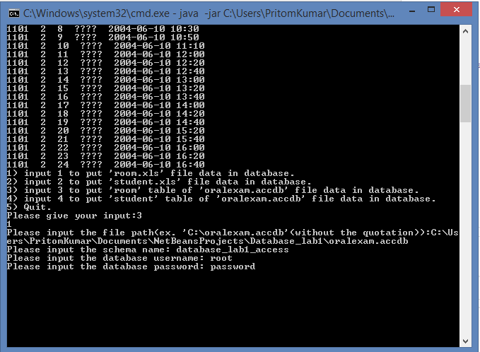

# Excel-Access-Data-To-MySQL-Database
A simple program to extort excel and access data to MySQL database

#File Description
There are five important files in the src directory.

  1. Main.java : This is the file from where the program starts.
  2. Options.java : This file contains all the options for the program. The inputs are also taken care in this file.
  3. ExcelToMySQL.java : In this class data of excel files inserted to mysql database.
  4. accessFile.java : There are two methods for two different table.We can use only one method as well. But for simplicity two different      methods has been created.
  5. dbConnection.java : This class is for connecting to the mysql database.

#Necessary Downloads
In order to run this program you need to download some .jar files.Most important ones are: **jackess-2.1.5.jar** , **poi-3-11-beta3-2014111.jar** , **ucanaccess-3.0.7.jar**

*Note that all these files needed to be up to date.*

#How to Run

Before you run the program you need to setup **MySQL Workbench** .
Need to add a new schema (For ex. database_lab1) . Then need add tables. For this program you need to add two tables and they should be named "room" and "student".
**room** table should have 6 columns.
The columns should be named as:

**room** Table
  
    # kdno kcno ccno kdname exptime papername

column name   type
----------- --------------------
kdno          VARCHAR(10)

kcno          INT

ccno          INT

kdname        VARCHAR(45)

exptime       VARCHAR(45)

papername     VARCHAR(45)

**student** Table
  
    # registno name kdno kcno ccno seat

column_name           type
-----------           --------------------
registno              VARCHAR(10)

name                  VARCHAR(40)

kdno                  VARCHAR(10)

kcno                  INT

ccno                  INT

seat                  INT

*Note : Similar steps should be followed for access file data*

Ones you are done with the MySQL settings you can follow the following steps to run the program. There are two ways to run the program.
    1. Extract the zip file and import the files in the IDE (NetBeans is recommanded). After importing the project run it. Make sure you       have the necessary libraries downloaded.
    2. Extract the zip file then inside the 'Database_lab1' there will be another file named 'dist'. Go inside the file, you can find a       'Database_lab1.jar' file there. Copy the file path of that file. Now open `cmd` then in the console type the following code:
          
          # java -jar "jar file path"
          
 *Note: the 'jar file path' should be like this*
        
        # C:\something\something\Database_lab1.jar
        
#Input and Output

After you run the program, the first thing will appear is the options. Like the picture below:

**Actions for the options:**
 
 1. If you choose option 1 first system will ask for the filepath of 'room.xls' file. Then it will ask for the schema name. After that you need to input the username and password of the database. After you give the inputs if no error found then data would appear in the console. after action finishes data will also be available in the database.
 
 

 2. Same as option 1. But file should be 'student.xls'
 
 3. If you choose option 3 first system will ask for the filepath of 'oralexam.accdb' file. Then it will ask for the schema name. After that you need to input the username and password of the database. After you give the inputs if no error found then data would appear in the console. after action finishes data will also be available in the database.
 
 *Note this instruction is for 'room' table*
 
 
 
 4. Same as option 3. But the oparation will be for 'student' table.
 
 5. Choose this option to quit the program.
 
 

